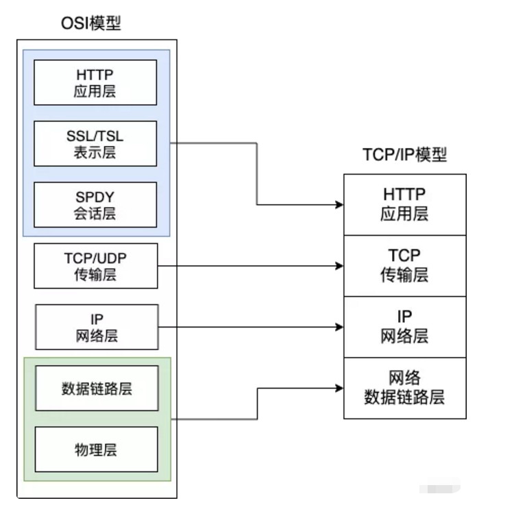

### 001：HTTP是什么？

1. HTTP是一种 **超文本传输协议**，是客户端和服务器端请求与应答的标准。
2. HTTP是一种 **应用层协议**，由请求和响应组成，是一个标准的客户端服务器模型。
3. HTTP是一种 **无状态协议**，每个请求与响应之间都是相互独立的，服务器默认情况下无法知道两个请求是否来自同一个客户端。
4. HTTP本质上来说就是一个 **通信规则**，规定了客户端发送给服务器以及服务器发送给客户端的内容格式。

### 002：HTTP和HTTPS的区别？✔️

1. HTTP 是超文本传输协议，信息是明文传输，HTTPS 协议要比 HTTP 协议**安全**，HTTPS 是具有安全性的 SSL 加密传输协议，可防止数据在传输过程中被窃取、改变，确保数据的完整性。
2. HTTP默认的端口号为 **80**，HTTPS的默认端口号为 **443**。
3. HTTPS 协议需要 CA 证书。
4. HTTPS 缓存不如 HTTP 高效，会增加数据开销。

### 003：TCP三次握手 ✔️

1. 第一次握手（**SYN**）：建立连接时，客户端发送SYN包（*SYN=1,Seq=x*）到服务器 ，并进入 `SYN_SENT` 状态，等待服务器确认。

2. 第二次握手（**SYN + ACK**）：服务器收到SYN包并确认客户的SYN（*ACK=x+1*），同时发送一个自己的SYN包（*SYN=1,Seq=y*），即SYN + ACK包，此时服务器进入 `SYN_RCVD` 状态。

3. 第三次握手（**ACK**）：客户端收到服务器的SYN+ACK包，向服务器发送确认包ACK（*ACK=y+1*），此时客户端和服务器进入 `ESTABLISHED`（TCP连接成功）状态，完成三次握手。

### 004：TCP四次挥手

### 005：如何确保数据包传输的可靠性？

TCP协议

- SYN：同步序列编号（确保有序）
- ACK：确认号（解决丢包问题）

### 006：TCP和UDP的区别？

TCP和UDP是两种常见的传输协议。

1. TCP是连接导向的，提供可靠的数据传输，适用于对数据完整性要求较高的场景。
2. UDP是无连接的，提供实时性较高的数据传输，适用于对时延要求较高、数据丢失可以容忍的场景。
3. TCP有序、可靠，UDP无序、不可靠。
4. TCP没有数据包大小限制，UDP受限于最大传输单元（MTU）的大小（64KB以下）

根据具体需求选择TCP或UDP，TCP适用于可靠性要求高的场景，UDP适用于实时性要求高且数据丢失可以容忍的场景（*音视频流传输/游戏通信/DNS解析/网络广播等*）。

### 007：Cookie vs. Session ✔️

Cookie 和 Session 都是用于跟踪用户身份的会话机制，但它们在存储位置、容量、安全性等方面有显著区别。

工作原理：

1. **Cookie**
   - 服务器通过响应头中的 `Set-Cookie` 将 Cookie 信息发送给客户端，客户端将 Cookie 存储在本地。
   - 每次请求时，客户端通过请求头中的 `Cookie` 字段将 Cookie 发送给服务器。
2. **Session**
   - 用户第一次访问服务器时，服务器为该用户创建唯一的 `Session ID`，并将其存储在 Cookie 中发送给客户端。
   - 客户端每次请求时，通过 Cookie 将 `Session ID` 发送给服务器，服务器根据 `Session ID` 识别用户并维护用户数据。

对比：

| #          | Cookie                                           | HttpSession                                           |
| ---------- | ------------------------------------------------ | ----------------------------------------------------- |
| 存储位置   | 客户端                                           | 服务器端                                              |
| 存储容量   | 单个 Cookie ≤ 4KB，一个站点最多保存 20 个 Cookie | 无上限，但需考虑服务器性能，并设置 Session 删除机制   |
| 安全性     | 客户端可见，明文存储（不安全）                   | 存储在服务器端，无敏感信息泄露风险                    |
| 服务器压力 | 保存在客户端，不占用服务器资源                   | 保存在服务器端，每个用户产生一个Session，占用大量内存 |
| 跨域支持   | 支持跨域名访问                                   | 不支持跨域名访问                                      |

总结：

1. **Cookie**：存储在客户端，容量小，支持跨域，但安全性较低。
2. **Session**：存储在服务器端，容量大，安全性高，但占用服务器资源且不支持跨域。

### 008：HTTP/浏览器缓存机制 ✔️

HTTP 缓存是客户端和服务器之间通过缓存减少重复请求、提高性能的规则和策略。

浏览器在第一次请求后，再次请求时会遵循以下流程：

1. 强缓存
   - 浏览器检查缓存的 `header` 信息（如 `Expires` 和 `Cache-Control`）。
   - 如果命中强缓存，直接从缓存中获取资源，**不向服务器发送请求**。
   - **关键字段**：
     - `Expires`：设置具体的过期时间。
     - `Cache-Control`：通过 `max-age` 设置缓存有效期（秒）。
2. 协商缓存
   - 如果未命中强缓存，浏览器向服务器发送请求，携带缓存相关的 `header` 信息（如 `Last-Modified/If-Modified-Since` 和 `ETag/If-None-Match`）。
   - 服务器根据这些信息判断资源是否变化：
     - 如果未变化，返回 `304 Not Modified`，告知浏览器从缓存中获取资源。
     - 如果变化，返回最新的资源内容。
   - 关键字段
     - `Last-Modified/If-Modified-Since`：基于资源修改时间。
     - `ETag/If-None-Match`：基于资源的唯一标识。

HTTP缓存可以分为两种类型：

1. 强制缓存
   - 由服务器在响应头中设置，客户端在缓存有效期内直接从缓存中获取资源，**无需与服务器通信**。
   - **常用字段**：`Expires` 和 `Cache-Control`。
   
2. 协商缓存
   - 客户端与服务器通信，验证缓存是否有效。
   - 如果缓存有效，返回 `304 Not Modified`，客户端从缓存中获取资源。
   - **常用字段**：`If-None-Match` 和 `If-Modified-Since`。

### 009：HTTP状态码及其含义？✔️

1. **1XX：信息状态码**
   - 表示请求已被接收，继续处理。
2. **2XX：成功状态码**
   - `200 OK`：请求成功。
   - `201 Created`：请求成功并创建了新资源。
   - `202 Accepted`：请求已被接受，但尚未处理。
3. **3XX：重定向状态码**
   - `301 Moved Permanently`：永久重定向。
   - `302 Found`：临时重定向。
   - `303 See Other`：临时重定向，总是使用 GET 请求新 URI。
   - `304 Not Modified`：协商缓存，客户端可从缓存中获取资源。
4. **4XX：客户端错误状态码**
   - `400 Bad Request`：服务器无法理解请求格式。
   - `401 Unauthorized`：请求未授权。
   - `403 Forbidden`：禁止访问。
   - `404 Not Found`：资源不存在。
5. **5XX：服务器错误状态码**
   - `500 Internal Server Error`：最常见的服务器端错误。
   - `503 Service Unavailable`：服务器暂时无法处理请求（可能过载或维护）。

> 重点掌握：`301`（永久重定向）、`302`（临时重定向）、`304`（协商缓存）。

### 010：HTTP请求方法及其用途 ✔️

1. **GET**：获取资源。
2. **POST**：提交数据或附加新数据。
3. **PUT**：更新资源，需指定资源位置。
4. **HEAD**：获取响应头信息，不返回响应体。
5. **DELETE**：删除资源。
6. **OPTIONS**：获取 URL 支持的方法，返回 `Allow` 头信息（如 `GET, POST`）。
7. **TRACE**：触发远程应用层请求消息回路，用于诊断。
8. **CONNECT**：将请求连接转换为透明的 TCP/IP 通道，通常用于 HTTPS 隧道。

### 011：从浏览器地址栏输入url到页面显示的步骤 ✔️

相似问题：

1. 在浏览器里，从输入 URL 到页面展示，这中间发生了什么？
2. 浏览器导航流程？
3. 浏览器渲染页面的过程？

答题参考：

1. 浏览器首先判断输入的内容是URL还是关键字
   - 如果是关键字，则使用默认搜索引擎来查询。
   - 如果是请求的URL，则进入下一步（*查看缓存*）。

2. 浏览器检查请求资源是否存在缓存。
   - 存在，则校验新鲜度（有效期），如果足够新鲜，则提供给客户端，否则发起新的请求。
     - 检验新鲜：Expires（*http1.0*） / Cache-Control:max-age=值（*http1.1*）
   - 不存在：发起新的请求

3. 浏览器解析URL：获取协议、主机、端口号、路径、查询参数等。

4. 浏览器组装 HTTP（GET）请求报文。

5. DNS解析（域名解析），获取主机IP地址：

   浏览器缓存 → 本机缓存 → hosts文件 → 路由器缓存 → ISP DNS 缓存 → DNS递归查询（*可能存在负载均衡导致每次IP不一样*）

6. 建立TCP链接：三次握手（*参考面试题：003*）

7. TCP链接建立后，浏览器向服务器发送 HTTP 请求（*请求包括请求行、请求头和请求体*）。

8. 服务器处理请求：

   - 检查HTTP请求是否命中协商缓存，如果命中，则返回304。校验缓存是否新鲜的相关字段：
     - Last-Modified/IF-Modified-Since
     - Etag/IF-None-Match

   - 处理请求并准备响应（如查询数据库）。

9. 服务器响应请求：将响应报文通过TCP连接发送回浏览器。

10. 浏览器接收响应，然后根据情况选择关闭TCP链接（*四次挥手*）还是保留重用。

11. 浏览器检查响应状态码：处理 1XX、3XX、4XX、5XX 等非 2XX 状态码。。

12. 判断是否可以缓存。

13. 对响应的数据进行解码（*例如gzip压缩*）。

14. 根据资源类型决定如何处理（*假设资源为HTML文档*）。

15. 解析HTML，构建DOM树（将字符流解析为标记 — AST，生成 DOM 树）。

16. 解析过程中，如果遇到图片、样式表、js文件等资源则会启动下载，发起额外的网络请求。

17. 解析CSS，生成CSSOM树（将 CSS 字符流解析为标记 — AST，生成 CSSOM 树）

18. 合并 DOM 树和 CSSOM 树，生成渲染树

19. 布局（回流）：计算元素的位置和大小.

20. 绘制（重绘）：将渲染树中的元素转换为屏幕上的像素。

21. 显示页面：逐步显示页面内容

### 013：localStorage、sessionStorage、cookie 支持跨域么？✔️

1. localStorage 和 sessionStorage 存储的数据基于同源策略，数据只能在同源页面间共享，不支持跨域。

2. Cookie 可以设置为跨域访问，但有一些限制。

   通过设置 `SameSite` 属性控制跨域行为：

   - `SameSite=None; Secure`：允许跨域（仅 HTTPS）。
   - `SameSite=Lax`：允许跨域（仅 HTTPS），仅在顶级导航时发送 Cookie。
   - `SameSite=Strict`：禁止跨域。

`localStorage` 和 `sessionStorage` 不支持跨域，`Cookie` 可通过 `SameSite` 属性控制跨域行为。

### 014：常见 Web 安全威胁 ✔️

1. **XSS（跨站脚本攻击）**
   - 攻击者注入恶意脚本（如 JavaScript），窃取用户数据或劫持会话。
   - **防御**：对用户输入过滤/转义（如 `<script>` → `&lt;script&gt;`）。
2. **CSRF（跨站请求伪造）**
   - 诱导用户点击链接，以用户身份执行非预期操作（如转账）。
   - **防御**：使用 CSRF Token、检查 `Referer` 头。
3. **SQL 注入**
   - 通过输入恶意 SQL 语句，篡改数据库（如 `' OR 1=1 --`）。
   - **防御**：参数化查询（Prepared Statements），禁用拼接 SQL。
4. **DDoS（分布式拒绝服务）**
   - 用大量请求压垮服务器，导致服务不可用。
   - **防御**：流量清洗、CDN、限流（如 IP 限制）。
5. **中间人攻击（MITM）**
   - 拦截通信数据（如未加密的 HTTP）。
   - **防御**：强制 HTTPS（SSL/TLS）。
6. **信息泄露**
   - 敏感数据暴露（如日志、错误信息显示数据库密码）。
   - **防御**：加密存储、最小权限原则。

总结：过滤输入、加密传输、权限控制、防脚本注入。

### 003：OSI模型

网络架构模型除了**TCP/IP模型**之外，还有**OSI模型**。**OSI** 模型实际上是多了两层（表示层/会话层）。

